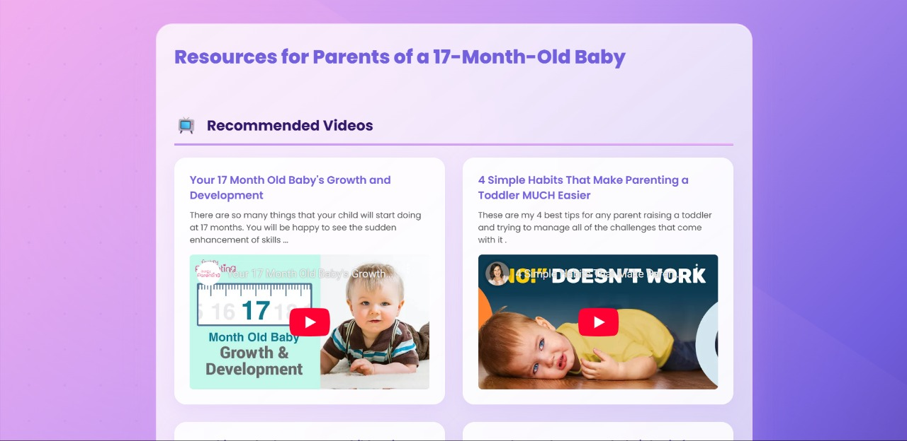
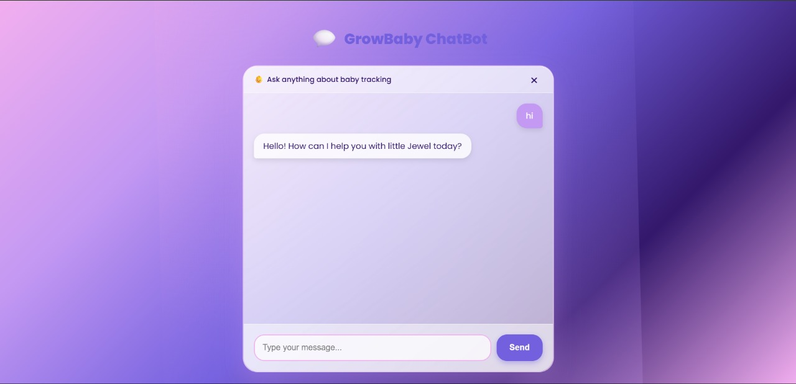
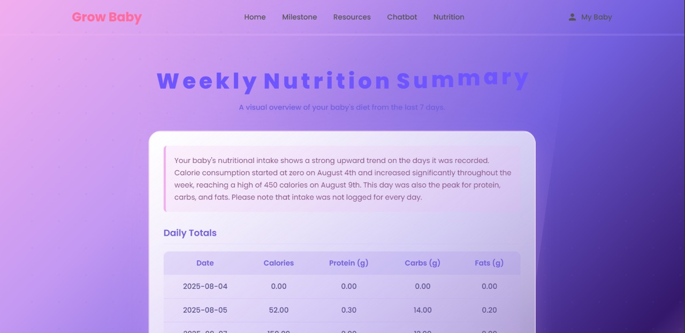
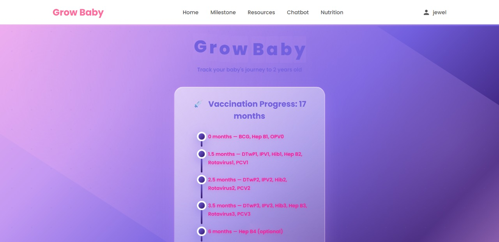
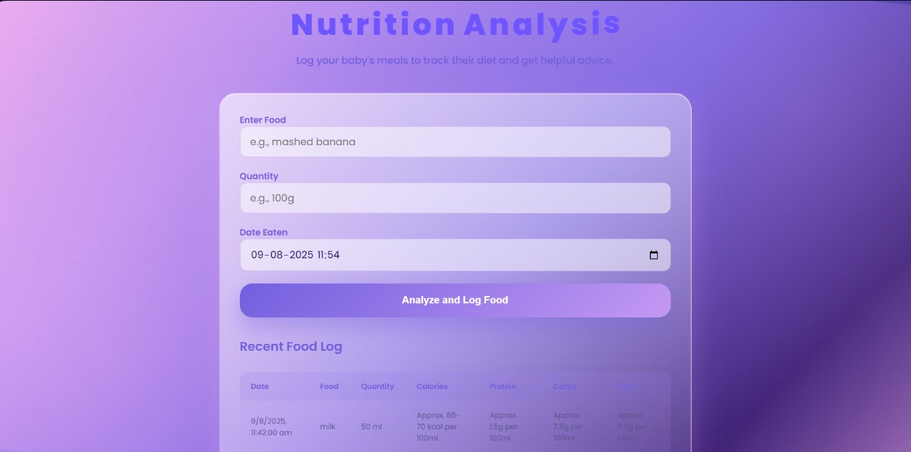

#  Grow Baby

**Grow Baby** is a comprehensive web application designed to help new parents track and manage their baby's health, nutrition, and development — all in one convenient place.  
Built with a **modern tech stack** and powered by **Google Gemini AI**, it provides personalized insights, reminders, and curated parenting resources.

---

# ✨ Features at a Glance

- **👶 Personalized Baby Profile** – Create a profile with your baby's name, date of birth, and gender.  
- **💉 Vaccination Tracker** – Visual, age-based tracker to monitor vaccination schedules.  
- **📜 Milestone Log** – Record and view important developmental milestones.  
- **🥗 AI-Powered Nutrition Analysis** – Log meals and get instant nutritional breakdown & tips.  
- **📊 Weekly Nutrition Summary** – AI-generated insights with charts and trends.  
- **🎥 Parenting Resources** – Curated videos & articles fetched dynamically.  
- **🤖 AI Chatbot** – Ask baby care & development questions anytime.

---

# 🛠️ Tech Stack

| Category       | Technologies |
|----------------|--------------|
| **Backend**    | Node.js, Express.js |
| **Frontend**   | EJS (Embedded JavaScript Templating) |
| **Database**   | MongoDB |
| **AI**         | Google Gemini API (`gemini-2.5-pro`, `gemini-2.0-flash-preview-image-generation`) |
| **Libraries**  | Mongoose, yt-search, rss-parser, Chart.js, anime.js |

---

# 📦 Installation Guide

## 1️⃣ Clone the Repository
```bash
git clone [your-repository-url]
cd growbaby
```

## 2️⃣ Install Dependencies
```bash
npm install
```

## 3️⃣ Configure Environment Variables
Create a `.env` file in the root directory:
```env
GEMINI_API_KEY="your_api_key_here"
MONGO_URI="mongodb://localhost:27017/growbabyDB"
```

## 4️⃣ Start MongoDB
Make sure your local MongoDB server is running.

## 5️⃣ Run the Application
```bash
node app.js
```

## 6️⃣ Access in Browser
Visit: [http://localhost:3000](http://localhost:3000)

---

# 💡 How to Use

## 📝 Profile Setup
If no baby profile exists, you'll be redirected to `/profile` to create one.

## 🏠 Home Page
Displays the **vaccination tracker**.

## 🎯 Milestones
Add and view developmental achievements.

## 🍽 Nutrition
Log daily meals and receive AI-powered insights.

## 📚 Resources
Get curated age-based videos & articles.

## 💬 Chatbot
Ask parenting-related questions in real time.

---

# 🔮 Planned Enhancements

- **🔑 User Authentication** – Support for multiple parents & profiles.  
- **📈 Growth Charts** – Height & weight tracking over time.  
- **⏰ Notifications** – Alerts for upcoming vaccinations.  
- **🌍 Multi-language Support** – For global accessibility.  
- **💤 AI Sleep Schedule** – Recommendations based on baby's age.

---

# 👥 Team – *Team Pazhampori*

- **Joel Jeggy**  
- **Adarsh Pravi**  
- **Jerry Bernard**  
- **Athil Johnson**

---

# 🖼 Screenshots

<p align="center">
  <br><br>
  <br><br>
  <br><br>
  <br><br>
  
</p>

---
